# 船舶智能热成型控制系统软件 V1.0  

使用说明  

# 1 引言  

# 1.1 编写目的  

本操作使用说明书详细描述了《船舶智能热成型控制系统软件 V1.0》的总体结构、系统功能，以及各功能模块的操作使用方法，供公司各部门和各类用户使用时参考。  

# 1.2 说明  

本软件由北京机科国创轻量化科学研究院有限公司开发。  

# 1.3 参考资料  

1 .《计算机软件用户手册国家标准 》  

# 2 软件概述  

# 2.1 软件用途  

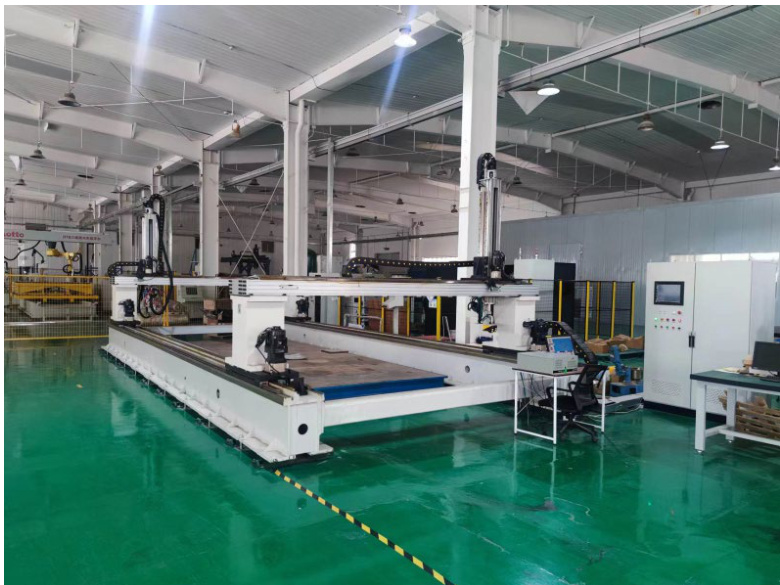  
图 1 船舶智能热成型设备  

船舶智能热成型控制系统软件针对船舶智能热成型设备而开发的配套设备控制软件，应用领域为船舶制造行业，旨在为船舶制造热成型工艺提供流程的操作和控制服务。本软件针对船舶智能热成型设备，实现视觉系统、机械结构底层控制系统、点云数据处理中心的联动与通讯，具有视觉系统通讯、视觉系统自动标定、三维模型重构、模型配准、可视化路径规划以及机械系统控制等功能。本软件功能齐全，操作方便，安全性高。本软件能够实现船舶智能制造热成型工艺过程中板材测量和热加工功能；操作界面简洁明了，按键清晰明确，操作人员能够迅速熟悉操作流程；界面中设有设备紧急制动按钮，安全可靠。  

# 2.2 功能介绍  

船舶智能热成型控制系统软件基于 .Net Framework 4.8 框架，采用 C  

Sharp 中 WPF 模块设计开发。软件功能主要分为四类：热成型流程控制、机械控制、模型配准和工艺参数设定，各类的功能如图 2 所示。  

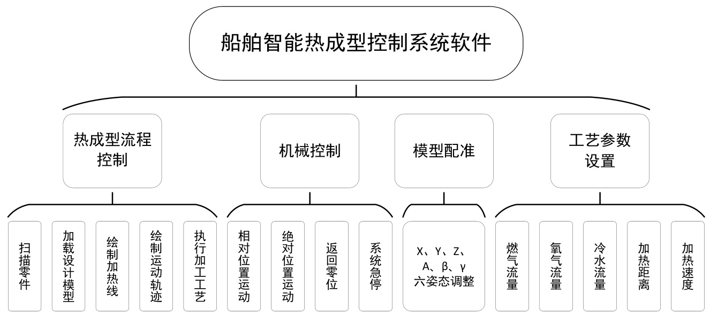  
图 2 各个模块功能  

热成型流程控制中的功能，是基于船舶制造中智能热成型的工艺流程设计的，实现了零件扫描、设计模型加载、加热线设计、路径计算和工艺执行等流程。机械控制功能负责系统中机械结构的控制，可以实现双龙门机械系统中12 个轴的相对位置运动、绝对位置运动、返回零位和系统急停的功能。模型配准是在“扫描零件”和“加载设计模型”功能操作完成后，手动调整设计模型的姿态（空间位置和空间角度），使得设计模型与测量模型进行配准，实现设计模型与测量模型的对比与测量。工艺参数设置可以设置热成型工艺过程中关键工艺参数：燃气流量、氧气流量、冷水流量、加热距离和加热速度。  

# 2.3 运行环境  

# 2.3.1 硬件要求  

工控机， $\mathrm { C U P } \geqslant 2 . 4 \mathrm { G H Z }$ ，内存 $\geqslant 8 \mathbf { G }$ ，硬盘 ${ \geqslant } 4 0 \mathrm { G }$ 。  

# 2.3.2 软件要求  

1. Windows 10 及以上。  
2. .Net Framework 4.8。  

# 3 软件使用说明  

# 3.1 主界面介绍  

软件主界面分为 4 个区域，分别为热成型操作面板、三维可视化交互窗口、功能切换模块和状态显示模块，如图 3 所示。  

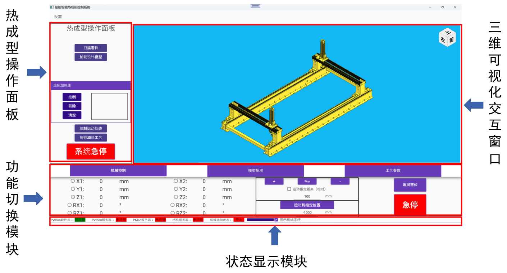  
图 3 主界面分区  

在热成型操作面板中，所涵盖的操作功能主要负责控制热成型加工过程的流程。在功能切换模块中，可以点击“机械控制”、“模型配准”、“工艺参数”三个卡片，切换到相应的功能分区。在三维可视化交互窗口中，可以实时显示系统机械结构的实时姿态、扫描后的零件、设计模型、加热线、加工路径等内容，同时可以对扫描后的模型进行点击和选择，实现交互式的加热线涉及过程。状态显示模块显示其他系统的通讯情况，并且可以选择是否显示机械结构。  

# 3.2 热成型加工过程  

（1） 扫描零件  

点击热成型操作面板区域中的“扫描零件”按钮，系统会自动对加工区域内的零件进行扫描，重构零件的三维模型，扫描后的结果图 4 所示，其中红色点云为扫描的零件模型。  

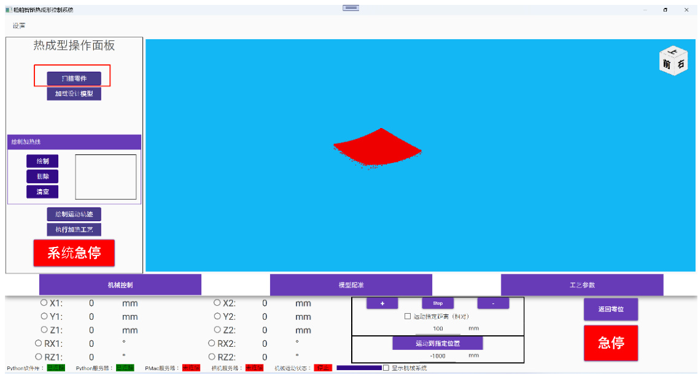  
图 4 扫描零件并获得零件模型  

（2） 加载设计模型  

点击“加载设计模型”按钮，在弹出的文件选择对话框中选择相应的设计模型文件，文件类型支持 stp 和 igs 格式，如图 5 所示。选择完毕后，设计模型（白色）即可显示在三维可视化交互窗口中，如图 6 所示。  

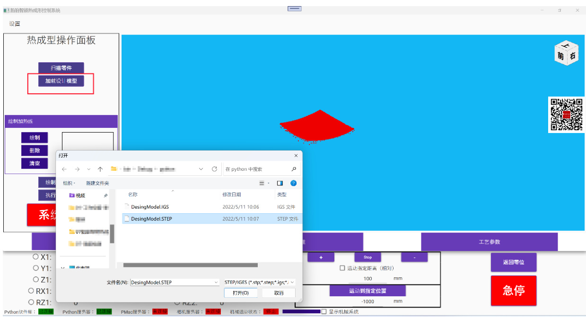  
图 5 选择设计模型文件  

  
图 6 设计模型显示在界面中  

（3） 模型配准  

导入设计模型后，需要将设计模型与扫描模型进行对齐。根据设计模型与扫描模型的误差，设计加热线。点击“模型配准”标签，在标签页中可以调整设计模型的姿态（X、Y、Z、RX、RY、RZ），配准后的结果如图7 所示。  

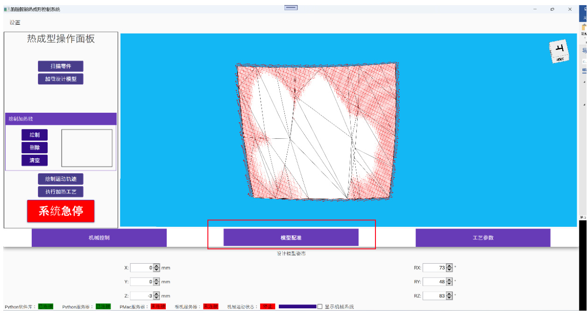  
图 7 模型配准  

# （4） 绘制加热线  

模型配准后，需要根据设计模型和扫描模型的误差设计零件表面的加热线。在扫描模型（红色点云）中，可以使用鼠标点击选中或者取消选中点。在选择一些点后（如图 8 所示），点击绘制加热线框中的“绘制”按钮，系统可以根据选择点的顺序，自动生成扫描模型表面的加热线，如图 9 所示。  

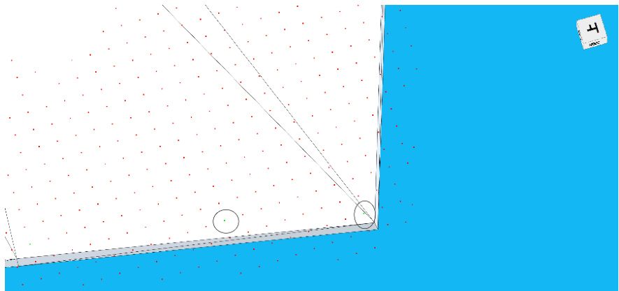  
图 8 选中点（颜色由红色变为绿色）  

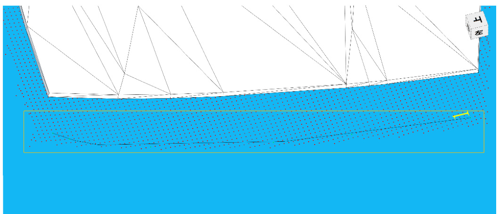  
图 9 自动生成加热线（黑色）  

除此之外，还可以在列表中选择加热线，点击“删除”按钮，删除选中的加热线。点击“清空”按钮，可以删除所有的加热线。  

# （5） 绘制运动轨迹  

绘制加热线后，点击“绘制运动轨迹按钮”，系统会自动生成热成型加工工艺中机械结构的运动轨迹。如图 10 所示，运动轨迹包括两个部分：加热冷却同时执行部分（蓝色点）和仅冷却部分（黑色点）。  

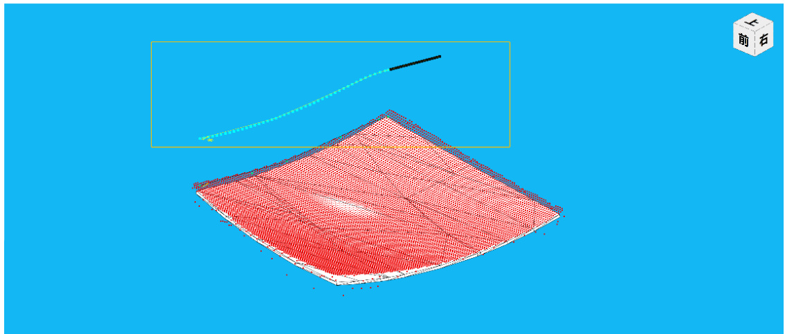  
图 10 绘制运动轨迹  

（6） 执行加热工艺  

绘制完加热线后，点击“执行加热工艺”按钮，系统会自动执行加热工艺过程，如图 11 所示。  

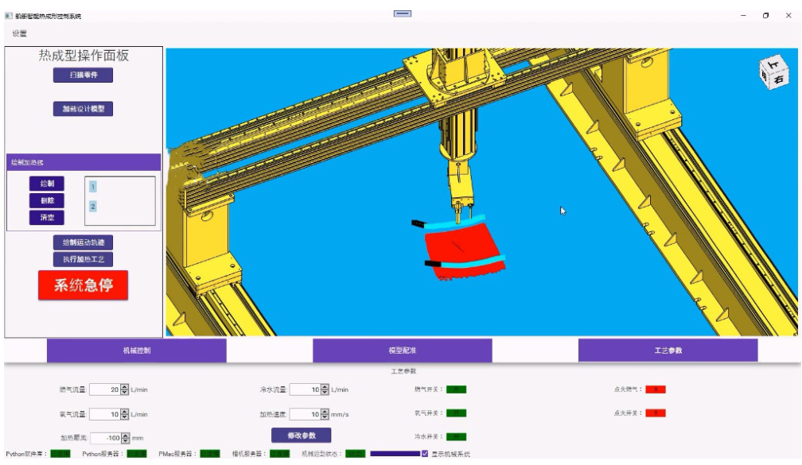  
图 11 执行加热工艺  

# 3.3 机械控制  

在机械控制标签页可以对双龙门机械结构进行单独的控制。如图 12 所示，在点击 X1、X2 ……RZ1、RZ2 前方的单选按钮，可以选择要控制的运动轴。选中要控制的运动轴后，短时点击 $^ { 6 6 } + \ l ^ { 9 }$ 或者“-”按钮，可以小范围控制运动轴；长按 $" \mathrm { + } \mathbf { \cdots }$ 或者“-”按钮，运动轴可以一直运动，直到按钮松开。在勾选“运动指定距离”框后，并在下方的文本框中输入距离（必须为正数），点击 $^ { 6 6 } + \prime 9$ 或者“-”按钮，运动轴在当前位置基础上，沿着正方向或者反方向运动指定距离（相对运动）；如果在运动过程中，点击了“stop”按钮，运动轴会终止本次运动。  

在按钮“运动到指定位置”下方的文本框中，输入具体的数值（正数负数均可），然后点击“运动到指定位置”按钮，运动轴会运动至在系统默认运动坐标系中的，文本框中所输入的绝对位置。  

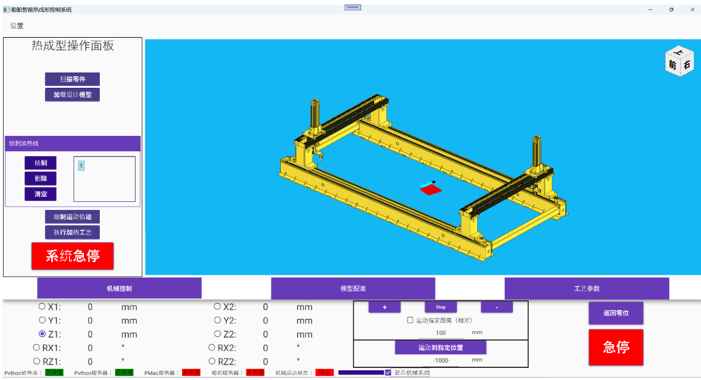  
图 12 机械控制标签页  

# 3.4 模型配准  

模型配准功能的使用方法，如3.1 小节中（3）中所示的方法。  

# 3.5 工艺参数  

工艺参数分为两个区域：工艺参数设置区域和工艺状态区域。如图 13所示，在工艺参数设置区域，可以对燃气流量、氧气流量、冷水流量、加热速度、加热距离进行设置，可以输入具体的数值，也可以点击输入框右侧的上下箭头进行微调，修改工艺参数数值完毕后，点击“修改参数”按钮，修改的数值生效。在工艺状态区域，可以实时监测到工艺执行过程中，氧气开关、燃气开关、冷水开关、点火燃气开关和点火开关的状态，红色为关闭状态，绿色为打开状态。  

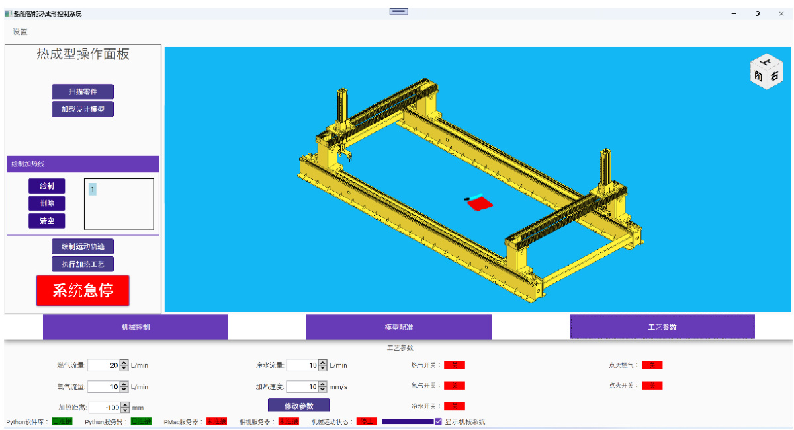  
图 13 工艺参数设置标签  