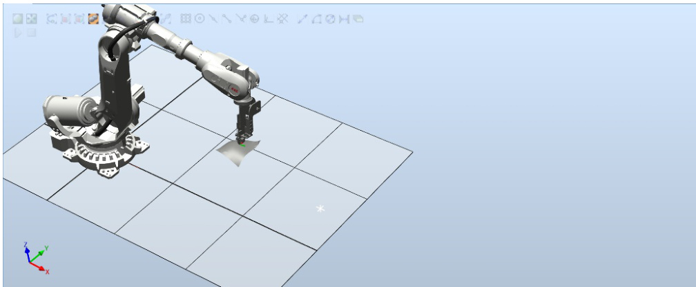

# 自动铺放路径生成软件 V1.0  

使用说明  

# 1 引言  

# 1.1 编写目的  

本操作使用说明书详细描述了《自动铺放路径生成软件 V1.0》的总体结构、系统功能，以及各功能模块的操作使用方法，供公司各部门和各类用户使用时参考。  

# 1.2 说明  

本软件由北京机科国创轻量化科学研究院有限公司开发。  

# 1.3 参考资料  

1 .《计算机软件用户手册国家标准 》  

# 2 软件概述  

# 2.1 软件用途  

自动铺放路径生成软件针对复合材料自动铺放领域中的路径规场景定制开发的专业路径生成软件，应用领域为复合材料自动铺放、增材制造等领域，旨在为自动铺放技术提供自动化的路径生成服务针对STL 原始模型，实现了原始模型显示、模型重构、法向量计算、生成参考线、计算距离场、生成路径、保存路径参数、生成机器人模块等功能，采用不同方法，分别实现了参考线生成和路径线生成的功能。本软件功能齐全，操作方便，兼容性高。本软件针对原始模型，可以采用不同方法路径线的生成，最终生成可执行的机器人模块文件；操作界面简洁明了，按键清晰明确，操作人员能够迅速熟悉操作流程；可兼容不同类型的机器人、不同坐标系的模型，兼容性和个性化程度高。  

# 2.2 功能介绍  

自动铺放路径生成软件基于 Python3.9.7 框架，采用 VsCode 编程软件开发，使用了Tkinter 模块设计程序主界面。软件功能按照路径生成流程分为主要分为 8 个部分：显示 STL 模型、重构 STL 模型、设置模型法向量、生成参考线、计算距离场、生成路径线、保存生成参数、生成ABB 机器人模块，每个部分的功能如图 1 所示。  

  
图 1 各个模块功能  

其中，其中显示STL 模型可以展示要规划的曲面模型；重构STL 模型可以使用历史数据和重新重构模型；设置模型法向量也是路径规划中的重要步骤，在这个步骤中，设置了模型计算法向量的相关参数，为后续的精确的路径姿态计算，提供了重要的基础；生成参考线功能可以查看模型边缘，在显示的模型边缘中，按照实际情况设置参考路径起始点，并且可以设置参考线的相关参数，最终生成参考线。计算距离场功能可以使用历史的距离场数据，也可以重新计算距离场、查看距离场的计算结果，并保存距离场结果。在完成距离场的计算之后，就可以使用距离场结果，生成路径线并产看生成的结果，如果对结果不满意，可以对前面设置的参数进行修改。在完成上述步骤之后，可以对上述操作过程中的参数进行保存，方便下次快速调用。最后，根据生成的路径线，可以自动生成ABB 机器人的运动模块，使用ABB 机器人，加载模块后，机器人即可自动执行路径。  

# 2.3 运行环境  

# 2.3.1 硬件要求  

工控机， $\mathrm { C U P } \geqslant 2 . 4 \mathrm { G H Z }$ ，内存 $\geqslant 8 \mathbf { G }$ ，硬盘 ${ \geqslant } 4 0 \mathrm { G }$ 。  

# 2.3.2 软件要求  

1. Windows 11 及以上。  
2. Python 3.9.7。  

# 3 软件使用说明  

# 3.1 主界面介绍  

软件主界面分为 3 个区域，分别为流程控制模块、参数设置模块和信息显示模块，如图 2 所示。  

  
图 2 主界面分区  

在流程控制模块中，所涵盖的操作功能主要负责整个路径规划生成流程。在参数设置模块中，可以对每个流程中相应的参数进行设置，用来生成最终的路径和ABB 机器人模块。在信息显示模块中，可以显示每个流程中的相关信息，包括过程信息、结果信息、报错信息等。  

# 3.2 路径规划过程  

（1） 显示 STL 模型  

点击主界面中的“显示STL 模型”按钮，如图 3 所示。在弹出的文件选择框中，选择要操作的模型，如图 4 所示。点击确定后，可以在弹出的对话框中，显示要操作的模型，以确定模型是否正确，如图 5 所示。  

  
图 3 显示 STL 模型界面  

  
图 4 选择模型文件界面  

  
图 5 模型显示界面  

（2） 重构 STL 模型  

在步骤（1）中确认要操作的模型后，点击“重构SLT 模型”按钮，在显示的重构SLT 模型界面中，有两个按钮：“使用历史模型”和“重新重构模型”。点击“使用历史模型”按钮， 如果该模型之前已经被重构过，则会调用历史的重构模型，如果没有被保存过，则重新重构模型；点击“重新重构模型“则无论该模型被保存过，都会重构，如图 6 所示。  

  
图 6 重构 STL 模型  

# （3） 设置模型法向量  

点击流程控制模块中的“设置模型法向量”按钮，如所示。可以设置模型法向量的计算参数，这个步骤是路径规划中非常重要的参数设置步骤，涉及到后续的路径姿态计算。在模型法向量计算的参数中，有两个重要参数：计算半径和最大邻居数。计算半径是指，在计算某个点P 的法向量时，以该点为重心，设置一个半径为 R 的球体，球体内的所有点，可以用来计算法向量。最大邻居数是指，在半径为R 的球体中，距离P 点最近的M 个点，最终会用来计算法向量。设置完上述两个参数后，点击“确定”按钮，然后再点击“显示”按钮，可以显示法向量的计算结果，如所示，如果法向量的计算结果不满足要求，则可以重新设置上述两个参数。  

  
图 7 设置模型法向量  

  
图 8 法向量计算结果  

# （4） 生成参考线  

点击“生成参考线”按钮，在参数设置模块中，点击“查看模型边缘”  

按钮，如图 10 所示。在显示的模型边缘中，可以看到模型边缘及顶点序号，根据显示结果，选择起始点的位置，并记录相邻的两个序号，如图 9 所示。并在参数设置模块中，将两个序号分别填入“顶点序号1”和“顶点序号2”中。距离比例的参数设置范围为[0,1]，数值越小起始点越靠近顶点1，数值越大，起始点越靠近顶点2。其次，如果在以往的操作中，保存过该模型的历史数据（后续步骤的功能），则在历史起始点的下拉框中，可以选择历史保存的起始点，自动填充到下面三个参数框中。  

  
图 9 参考线生成界面  

  
图 10 模型边缘显示结果  

点击“确认”按钮，如果起始点设置有问题，在信息显示模块中，会相应的显示起始点设置的问题，如果没有问题，则会显示“起始点信息设置成功！”，如图 9 所示。  

在“参考线生成方法”的下拉框中，选择相应的参考线生成方法，会显示不同的参数设置界面，根据需求，设置参数，点击“生成参考线按钮”就会显示参考线的生成结果，如图 11 所示。  

  
图 11 参考线生成结果  

（5） 计算距离场  

点击“计算距离场”按钮，显示计算距离场的参数界面，如图 12 所示。在计算距离场的参数界面中，可以选择使用哪种方法计算距离场。选择完方法后，如果该方法下有历史的距离场数据，则按钮“使用历史距离场数据”由灰色变为正常可点击的按钮，点击该按钮，则使用历史数据。如果点击“计算距离场”按钮，则重新计算距离场数据。点击完“使用历史距离场数据”或者“计算距离场”数据后，按钮“查看距离场”和“保存当前距离场结果”按钮，均由灰色不可点击状态变为正常可点击状态，并且可以点击产看距离场、保存距离场数据，如图 13 所示。  

  
图 12 计算距离场界面  

  
图 13 距离场计算结果  

（6） 生成路径线  

点击“生成路径线”按钮，可以设置生成路径线的结果。丝束宽度，即两条路径线之间的宽度；路径条数，可以设置生成的路径条数。若图 14  

所示。  

  
图 14 路径生成界面  

  
图 15 路径生成结果（路径条数 $\scriptstyle \left. = - 1 \right.$ ）  

实际路径条数 $\varprojlim .$ 路径条数 $\times 2 + 1$ ，其中“1”为在参考线生成步骤中生成的参考线，一条路径条数对应参考线中两侧的对称的两条路径。如果路径条数设置为-1，则默认将整个曲面铺满路径。  

点击“查看路径线”按钮，可以查看路径线的生成结果，如图 15 所示。  

（7） 保存路径生成参数  

在保存路径生成参数中，可以对如图 16 所示的参数进行保存，方便下次的使用。  

  
图 16 保存路径生成参数  

（8） 生成ABB 机器人模块  

在生成 ABB 机器人模块中，可以生成 ABB 机器人可执行的模块文件（.mod 格式）。可以对如图 17 所示中的参数进行设置，最终生成模块文件。  

在生成.mod 文件后，在机器人的仿真软件（或者控制手柄中），加载生成的.mod 文件，点击执行按钮，即可执行仿真（或者实际）的动作，如图 18、图 19 所示。  

  
图 17 生成机器人模块界面  

  
图 18 导入.mod 文件  

  
图 19 执行运动过程  