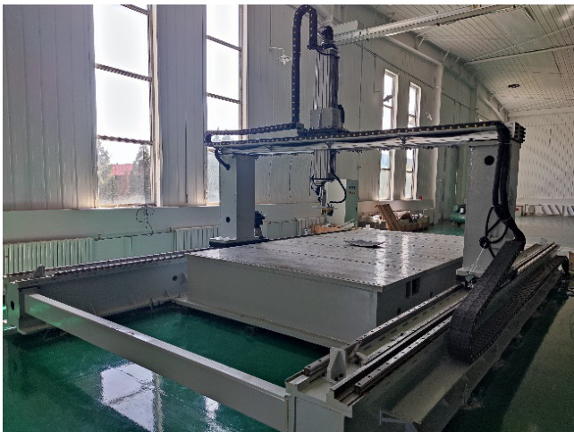
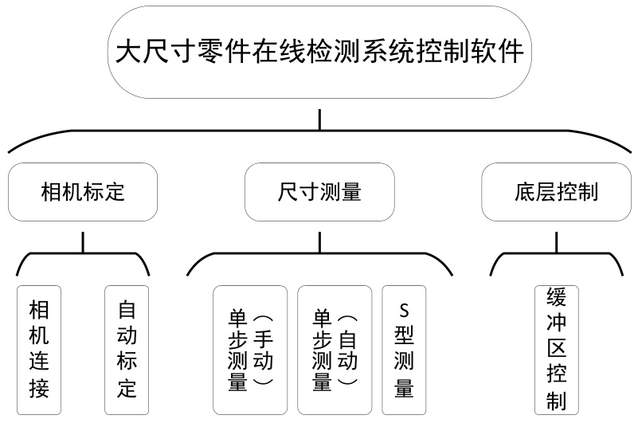
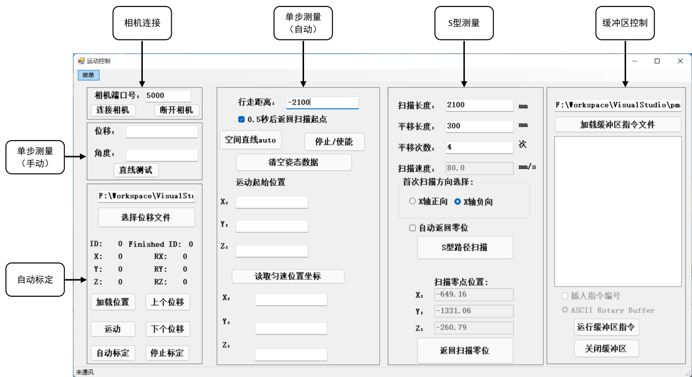
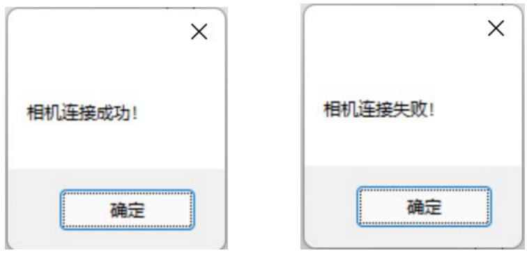
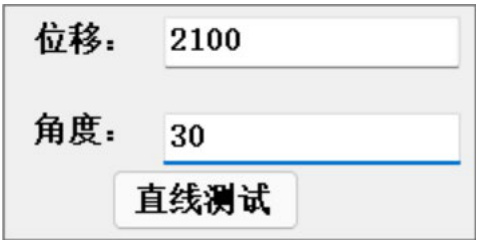
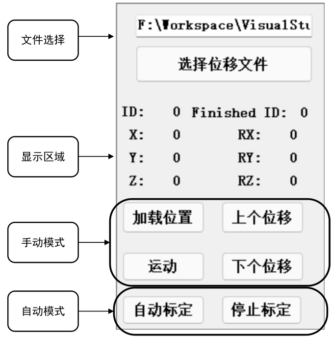
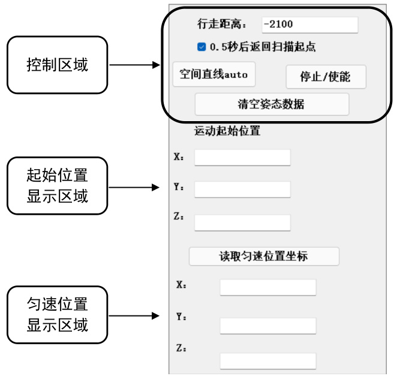
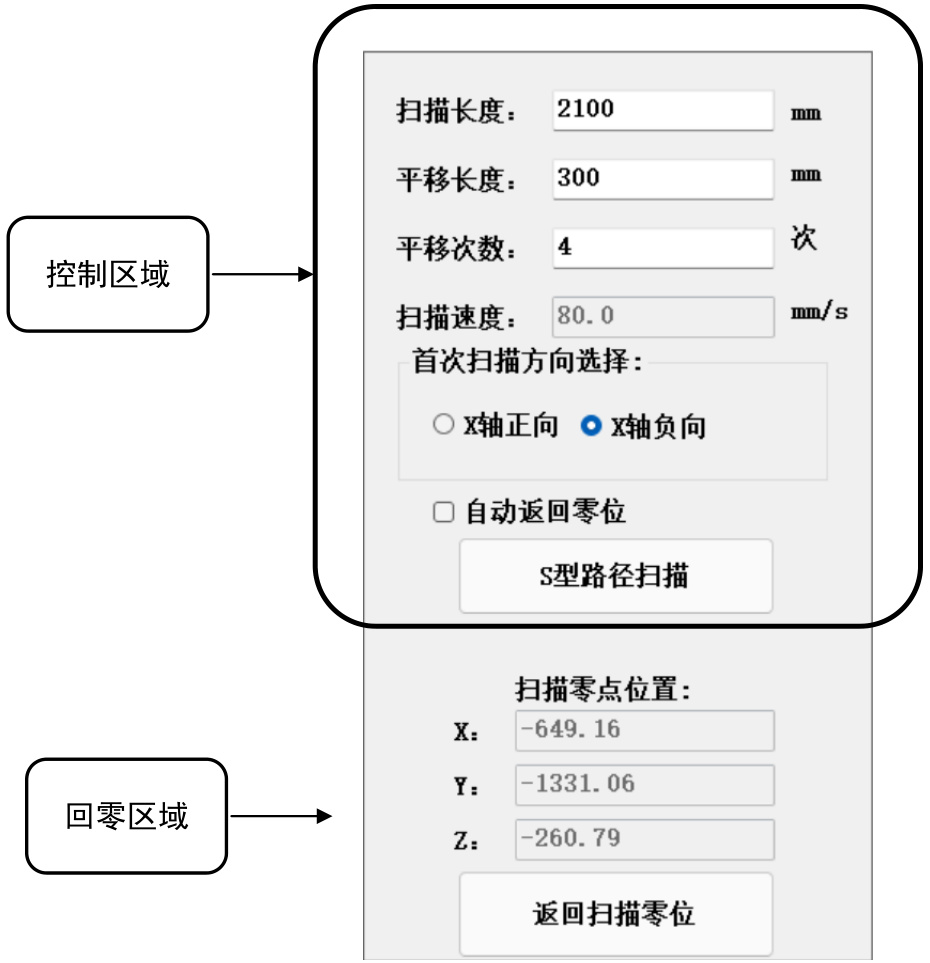
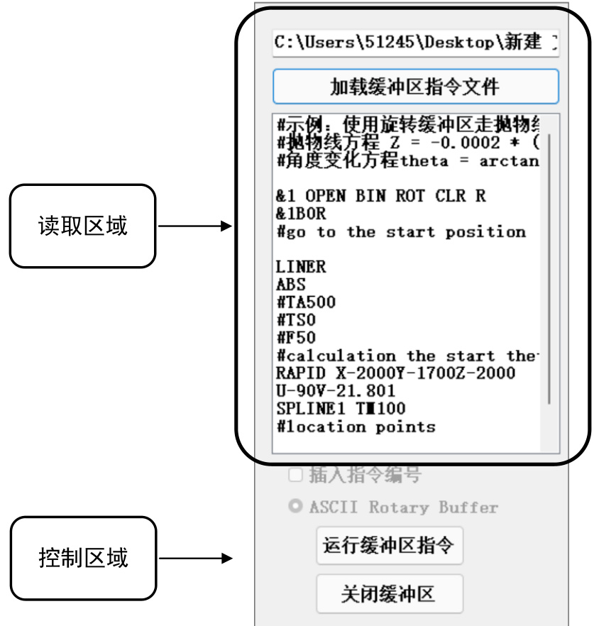

# 大尺寸零件在线检测系统控制软件 V1.0  

使用说明  

# 北京机科国创轻量化科学研究院有限公司  

# 1 引言  

# 1.1 编写目的  

本操作使用说明书详细描述了《大尺寸零件在线检测系统控制软件V1.0》的总体结构、系统功能，以及各功能模块的操作使用方法，供公司各部门和各类用户使用时参考。  

# 1.2 说明  

本软件由北京机科国创轻量化科学研究院有限公司开发。  

# 1.3 参考资料  

1 .《计算机软件用户手册国家标准 》  

# 2 软件概述  

# 2.1 软件用途  

  
图 1 船舶智能制造大尺寸在线检测设备  

大尺寸零件在线检测系统控制软件针对船舶智能制造大尺寸在线检测设备而开发的配套设备控制软件，应用领域为船舶制造行业，旨在为船舶制造加工和装配环节的大尺寸零件提供测量服务。本软件针对船舶智能制造大尺寸在线检测设备，实现视觉系统和机械系统底层控制系统的联动与通讯，具有视觉系统通讯、视觉系统自动标定、单步扫描、S 型扫描以及底层控制系统的缓冲区控制等功能。本软件功能齐全，操作方便，安全性高。本软件能够实现船舶制造中大尺寸多种需求的测量功能；操作界面简洁明了，按键清晰明确，操作人员能够迅速熟悉操作流程；界面中设有设备紧急制动按钮，安全可靠。  

# 2.2 功能介绍  

大尺寸零件在线检测系统控制软件基于 .Net Framework 4.5.1 框架，采用C Sharp 中Windows Form 模块设计开发。软件功能主要分为三类：相机标定、尺寸测量、底层控制，各类的功能如图1 所示。  

  
图 2 各个模块功能  

相机标定中的相机连接功能可以测试视觉系统是否连接成功，可以实现相机空间的自动化标定。尺寸测量中有三个主要功能，单步测量（手动）可以手动设置直线运动角度和距离，进行单步扫描测量；单步测量（自动）是按照设备当前的姿态，自动设置扫描的角度；S 型测量功能将采用S 型路径扫描拼接的方式，实现大尺寸零件的扫描测量。底层控制中缓冲区控制功能，可以将大量运动数据以缓冲数据的形式输入到底层控制器中，控制设备运动，防止底层控制接收到过多的控制指令而造成内存溢出。  

# 2.3 运行环境  

# 2.3.1 硬件要求  

工控机， $\mathrm { C U P } \geqslant 2 . 4 \mathrm { G H Z }$ ，内存 $\geqslant 8 \mathbf { G }$ ，硬盘 ${ \geqslant } 4 0 \mathrm { G }$ 。  

# 2.3.2 软件要求  

1. Windows 7 及以上。  
2. .Net Framework 4.5.1。  

# 3 软件使用说明  

软件运行之前需确认软件所处工控机、视觉系统、底层控制系统处于同一个IP 网段下。软件运行后，主界面如图1 所示，主要功能分区为相机连接、单步测量（手动）、单步测量（自动）、自动标定、S 型测量、缓冲区控制。  

  
图 3 主界面  

（1）相机连接  

  
图 4 相机连接  

相机端口号默认为5000，如果端口号发生改变，可以在文本框中更改。确认并输入端口号后，点击“连接相机”，如果连接成功，则会弹出“相机连接成功！”窗口，连接失败则弹出“相机连接失败！”窗口。点击“断开相机”，软件将会与视觉系统断开连接。  

  
图 5 相机连接结果  

（2）单步测量（手动）  

  
图 6 单步测量（手动）  

在进行单步测量（手动）之前，需要分别输入位移和角度，其中角度是在机械系统坐标系的XOY 平面内，与X 轴的夹角；位移为扫描的路径长度。  

（3）自动标定  

  
图 7 自动标定  

自动标定分为手动模式与自动模式。无论哪种模式，都需要点击“选择位移文件”按钮，选择保存自动标定起始位置的文件。  

手动模式在选择位移文件之后，点击“加载位置”，通过“上个位移”和“下个位移”按钮可以选择不同的起始点，点击“运动”按钮，则进行一次运动扫描。  

自动模式在选择位移文件之后，点击“自动标定”，程序会自动进行标定，其他按钮会变成灰色，直到标定结束。在自动标定过程中，点击“停止标定”，可以停止自动标定的流程。  

（4）单步测量（自动）  

  
图 8 单步测量（自动）  

单步测量（自动）在控制区域中，在“行走距离”文本框中输入单步测量（自动）需要扫描的距离，点击“空间直线 auto”按钮，系统会根据机械结构的当前姿态，自动设置扫描的角度，并按照“行走距离”文本框中设置的扫描距离进行扫描。如果勾选“0.5 秒后返回扫描起始点”，则在扫描结束后，自动返回扫描起点，否则将会停在扫描终点。  

在软件中，任何状态下，均可以点击“停止/使能”按钮，立即停止机械系统的运动，保证系统安全。  

每次运行单步测量（自动），系统会自动将扫描的起点记录至桌面文件“data2.txt”中，如果想清除文件中的信息，点击“清除姿态数据”即可。  

每次运行单步测量（自动），起始位置显示区域，会自动记录并显示本次扫描的起始位置，并在该区域中显示。  

点击“读取匀速位置坐标”，系统将从底层控制系统中，读取机械结构运动达到匀速的位置点，并显示在匀速位置显示区域中。  

（5）S 型测量  

  
图 9  

在 S 型测量中，文本框“扫描长度”、“平移长度”、“平移次数”可以对 S 型扫描的单次扫描长度、拼接宽度和拼接次数进行设置，扫描速度暂时无法设置（默认为 $8 0 \mathrm { m m / s } )$ ）。  

首次扫描方向选择，可以对扫描方向进行选择，可以沿着 X 轴正向或者反向进行扫描。  

在设置完上述参数后，点击“S 型路径扫描”，即可完成S 型测量过程。如果选择“自动返回零位”，则机械系统会在扫描结束后返回扫描起点，否则将会停留在扫描终点。  

点击“返回扫描零位”，可以手动将机械结构返回至扫描起点。  

（6）缓冲区控制  

  
图 10 缓冲区控制  

缓冲区控制可以将大量运动数据以缓冲数据的形式输入到底层控制器中，控制设备运动，防止底层控制接收到过多的控制指令而造成内存溢出。  

读取区域中“加载缓冲区指令文件”按钮，可以选择要加载的指令文件；选择正确的指令文件后，文件中的指令将在显示区域中显示。  

点击“运行缓冲区指令”按钮，可以开启底层控制系统中的缓冲区，并将文件中的代码输入到底层控制系统的缓冲区，对机械结构的运动进行实时控制。  

点击“关闭缓冲区”，可以将底层控制系统中的缓冲区进行关闭，并结束对底层控制系统的控制。  