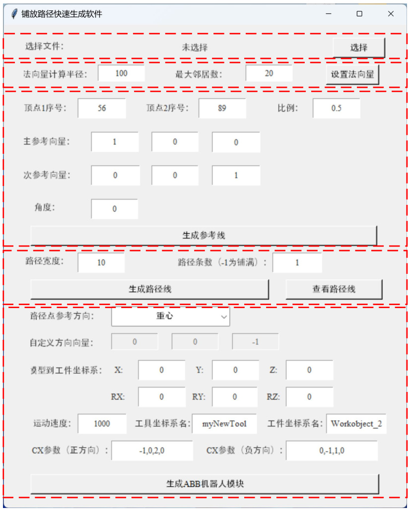
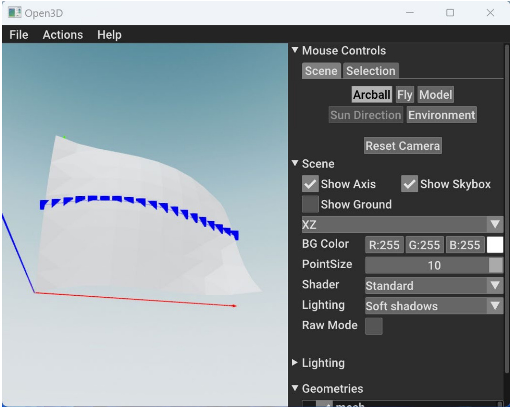

# 铺放路径快速生成软件 V1.0  

使用说明  

# 1 引言  

# 1.1 编写目的  

本操作使用说明书详细描述了《铺放路径快速生成软件 V1.0》的总体结构、系统功能，以及各功能模块的操作使用方法，供公司各部门和各类用户使用时参考。  

# 1.2 说明  

本软件由北京机科国创轻量化科学研究院有限公司开发。  

# 1.3 参考资料  

1 .《计算机软件用户手册国家标准 》  

# 2 软件概述  

# 2.1 软件用途  

本软件是针对复合材料自动普放技术定制开发的路径规划软件，旨在为自动铺放技术中的三维曲面等距路径自动规划功能，主要面向复合材料加工、增材制造等领域。  

本软件针对复合材料自动铺放技术场景，针对 STL 原始模型，实现了铺放路径快速生成方法，涵盖了原始模型显示、模型重构、法向量计算、生成参考线、计算距离场、生成路径、保存路径参数、生成机器人模块等  

功能。本软件功能完备，操作方便，兼容性高。针对原始模型，操作界面简洁明了，按键清晰明确，路径生成效率高效，操作人员能够迅速熟悉操作流程。  

# 2.2 功能介绍  

铺放路径快速生成软件基于 Python3.9.7 框架，采用 VsCode 编程软件开发，使用了Tkinter 模块设计程序主界面。软件功能按照路径生成流程分为主要分为6 个步骤：选择模型、设置法向量、生成参考线、生成路径线、查看路径线、生成ABB 机器人模块。在任意步骤中，如果该步骤的结果不满足要求，可以修改相应参数，重新生成。  

# 2.3 运行环境  

# 2.3.1 硬件要求  

工控机， $\mathrm { C U P } \geqslant 2 . 4 \mathrm { G H Z }$ ，内存 $\geqslant 8 \mathbf { G }$ ，硬盘 ${ \geqslant } 4 0 \mathrm { G }$ 。  

# 2.3.2 软件要求  

1. Windows 11 及以上。  
2. Python 3.9.7。  

# 3 软件使用说明  

# 3.1 主界面介绍  

铺放路径快速生成软件，为了提高路径生成的效率、降低软件操作的复杂度，只有一个主界面，所有操作均在主界面中完成。主界面如图 1 所示，主界面按照路径生成流程分为主要分为5 个区域（虚线框分割）：选择模型、设置法向量、生成参考线、生成路径线、生成ABB 机器人模块。  

  
图 1 主界面分区  

# 3.2 铺放路径快速生成  

主界面中，总共有6 个按钮（如所示），填入相应的参数后，按照顺序点击6 个按钮，即可快速生成ABB 机器人可执行的程序(.mode 格式)。  

  
图 2 铺放路径生成操作步骤  

（1） 选择 STL 模型  

点击主界面中的“选择”按钮。在弹出的文件选择框中，选择要操作的模型，如图 3 所示。点击确定后，可以在弹出的对话框中，显示要操作的模型，以确定模型是否正确，如图 4 所示。  

  
图 3 选择模型文件界面  

  
图 4 模型显示界面  

（2） 设置模型法向量  

在模型法向量计算的参数中，有两个重要参数：计算半径和最大邻居数。计算半径是指，在计算某个点 P 的法向量时，以该点为重心，设置一个半径为 R 的球体，球体内的所有点，可以用来计算法向量。最大邻居数是指，在半径为R 的球体中，距离P 点最近的M 个点，最终会用来计算法向量。设置完上述两个参数后，点主界面的“设置法向量”按钮，可以显示法向量的计算结果，如图 5 所示，如果法向量的计算结果不满足要求，则可以重新设置上述两个参数。  

  
图 5 法向量计算结果  

在查看法向量计算结果时，需要为下个步骤“生成参考线”，记录参考线的起始点的相关信息。如图 5 所示，实例中选择了顶点56（序号）和顶点89（序号）作为参考线起始点相关信息。  

# （3） 生成参考线  

在参考线参数设置模块中，将上个步骤中确定的两个序号分别填入“顶点 1 序号”和“顶点 2 序号”中。比例的参数设置范围为[0,1]，数值越小起始点越靠近顶点1，数值越大，起始点越靠近顶点2。然后点击“生成参  

考线”按钮，即可显示参考线的生成结果，如图 6 所示。  

  
图 6 参考线生成结果  

# （4） 生成路径线  

填入路径宽度，即两条路径线之间的宽度；路径条数，可以设置生成的路径条数。点击“生成路径线”按钮，系统会生成路径线，生成完毕后会弹出提示窗口，如图 7 所示。然后点击“查看路径线”按钮，即可显示生成后的路径线结果，如图 8、图 9 所示。  

实际路径条数 $\varprojlim .$ 路径条数 $\times 2 + 1$ ，其中“1”为在参考线生成步骤中生成的参考线，一条路径条数对应参考线中两侧的对称的两条路径。如果路径条数设置为-1，则默认将整个曲面铺满路径。  

  
图 7 路径生成界面  

  
图 8 路径生成结果（路径条数 $\scriptstyle : = - 1$ ）  

  
图 9 路径生成结果（路径条数 $\scriptstyle \left. = 1 \right.$ ）  

（5） 生成ABB 机器人模块  

在生成 ABB 机器人模块中，填入机器人相关的参数，可以生成 ABB机器人可执行的模块文件（.mod 格式）。在生成.mod 文件后，在机器人的仿真软件（或者控制手柄中），加载生成的.mod 文件，点击执行按钮，即可执行仿真（或者实际）的动作，如图 10、图 11 所示。  

  
图 10 导入.mod 文件  

  
图 11 执行运动过程  