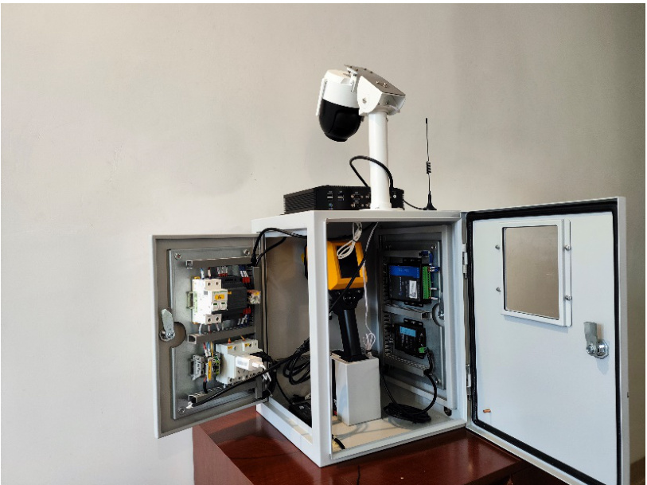
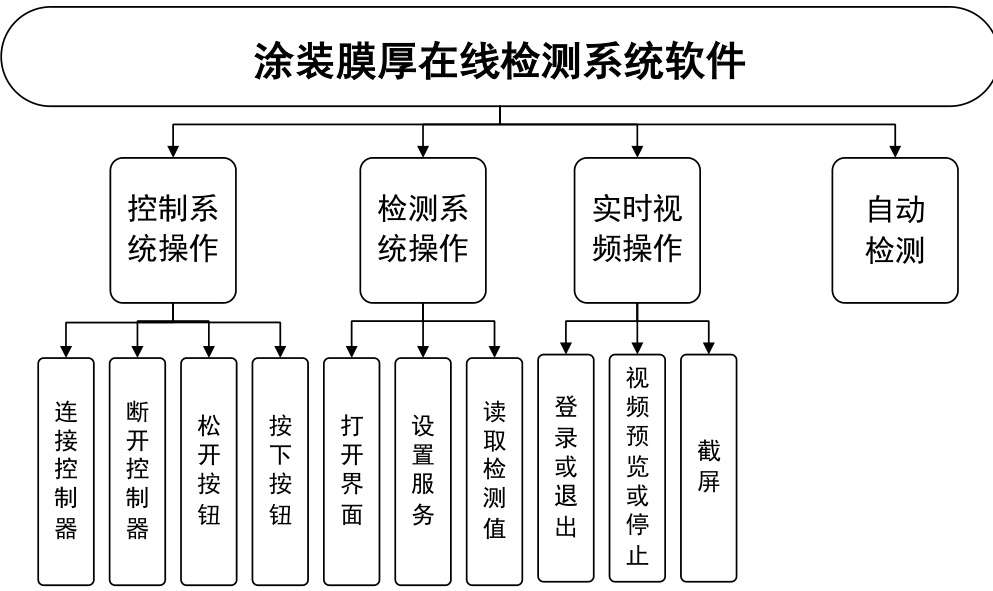
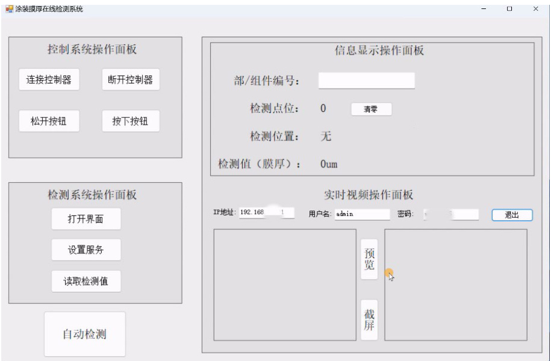
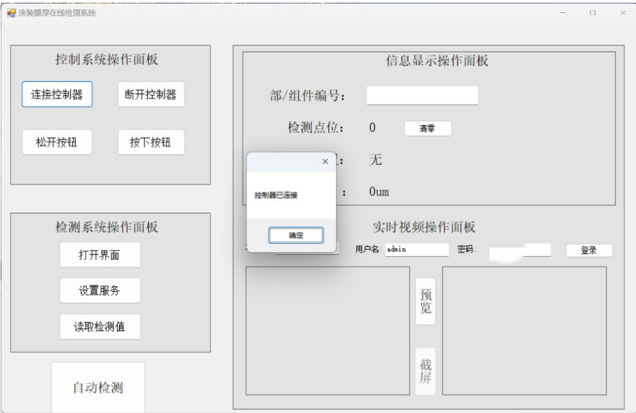
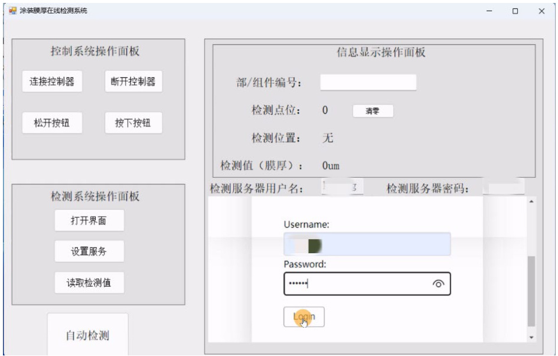
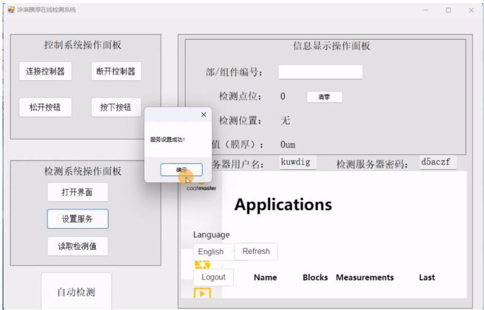
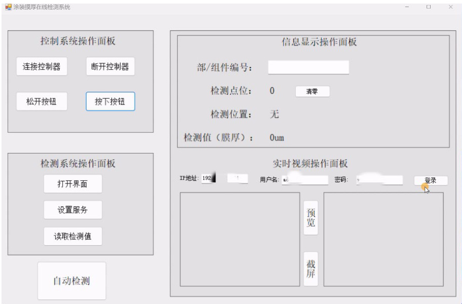
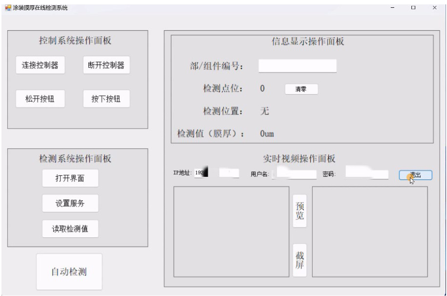
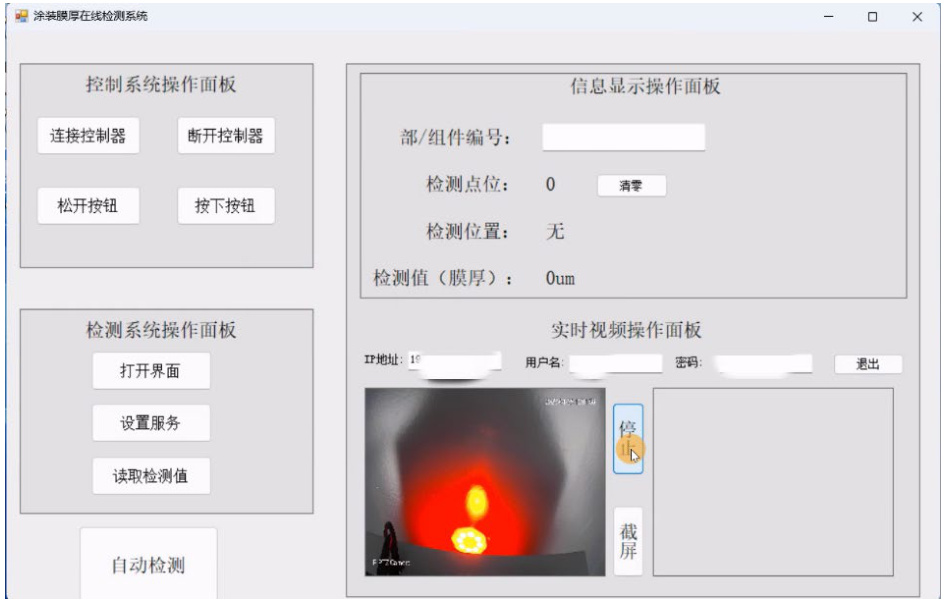
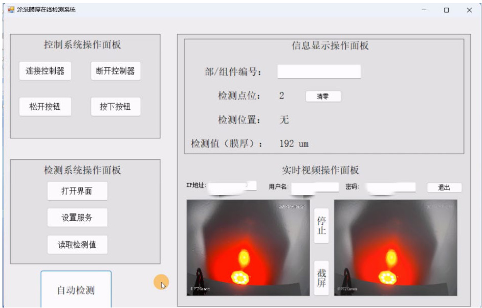

# 涂装膜厚在线检测系统软件 V1.0  

使用说明  

# 1 引言  

# 1.1 编写目的  

本操作使用说明书详细描述了《涂装膜厚在线检测系统软件 V1.0》的总体结构、系统功能，以及各功能模块的操作使用方法，供公司各部门和各类用户使用时参考。  

# 1.2 说明  

本软件由北京机科国创轻量化科学研究院有限公司开发。  

# 1.3 参考资料  

1 .《计算机软件用户手册国家标准 》  

# 2 软件概述  

# 2.1 软件用途  

  
图 1 涂装在线检测设备  

涂装膜厚在线检测系统软件是针对船舶涂装检测设备（如图 1 所示）而开发的配套设备控制软件，旨在为船舶制造过程中的涂装检测提供流程和设备控制服务，面向领船舶制造、加工检测等领域。本软件针对船舶智能热成型设备，能够实现船舶涂装过程中涂装湿膜厚度检测和涂装外观检测的目的，具有检测硬件机械控制、检测过程实时视频查看、涂装外观存储等功能。本软件功能齐全，操作方便，兼容性高，够实现船舶制造涂装工艺过程中涂装湿膜厚度检测和涂装外观检测的功能；操作界面简洁明了，按键清晰明确，操作人员能够迅速熟悉操作流程；操作过程安全可靠。  

# 2.2 功能介绍  

涂装膜厚在线检测系统软件基于.Net Framework4.7.2 框架，采用 VisualStudio 编程软件开发。软件功能分为主要分为4 个部分：控制系统操作、检测系统操作、实时视频操作和自动检测，每个部分的功能如图 2 所示。  

  
图 2 各个模块功能  

其中，控制系统操作可以实现对涂装在线检测设备的操控，包括连接控制器、断开控制器、松开按钮、按下按钮等功能；检测系统操作可以实现对检测服务器的设置，包括打开检测服务器的设置界面、设置服务、读取检测结果等功能；实时视频操作可以实现对摄像头的操作，包括登录或者登出摄像头系统、预览或者停止预览当前的实时视频画面，截取当前视频画面保存为图片等功能；自动检测按钮，可以实现点击后，硬件系统自动控制，按下检测按钮，然后读取检测服务器中的测量值，并把当前的视频画面截取保存，保存涂装检测的外观图片。  

# 2.3 运行环境  

# 2.3.1 硬件要求  

工控机， $\mathrm { C U P } \geqslant 2 . 4 \mathrm { G H Z }$ ，内存 $\geqslant 8 \mathrm { G }$ ，硬盘 ${ \geqslant } 4 0 \mathrm { G }$ 。  

# 2.3.2 软件要求  

1. Windows 11 及以上。  
2. .Net Framework 4.7.2。  

# 3 软件使用说明  

# 3.1 主界面介绍  

软件主界面分为 5 个区域，分别为控制系统操作面板、检测系统操作面板、信息显示操作面板、实时视频操作面板、自动检测按钮，如图 3 所示。  

  
图 3 主界面分区  

控制系统操作面板实现对涂装在线检测设备的操控；检测系统操作面板可以实现对检测服务器的设置；实时视频操作面板可以实现对摄像头的操作；信息显示操作面板可以显示湿膜厚度的检测结果；自动检测按钮可以实现一键式的检测功能，包括湿膜厚度检测和外观图像采集。  

# 3.2 控制系统操作  

（1） 连接控制器/断开控制器  

点击主界面中的“连接控制器”按钮，如果连接到控制器，则会弹出“控制器已连接”提示框，如图 4 所示。如果未连接控制器，则弹出“控制器未连接”的对话框。点击“断开控制器”按钮，系统则会与控制器断开连接。  

  
图 4 连接控制器成功  

# （2） 松开按钮/按下按钮  

在涂装在线检测设备中，有一个机械按钮，机械按钮可以实现伸出和缩回的功能，从而实现按下和松开实体按键的功能。在主界面中“松开按钮”和“按下按钮”就是控制这个机械按钮的动作的按键，当点击“按下按钮”时，机械按钮按下按键，设备触发膜厚检测功能；当点击“松开按钮”时，机械按键松开按键，完成检测过程。  

# 3.3 检测系统操作  

（1） 打开界面  

点击“打开界面”，主界面中的“实时视频操作面板”会暂时被检测服务器的设置面板替代，如所示。在打开的检测服务器界面中，分别在Username 和Password 框中输入对应的用户名和密码（用户名和密码在上方有提示），然后点击“Login”按钮，如图 5 所示。  

  
图 5 打开服务器界面  

在登录检测服务器后，如图 6 所示的界面。点击检测系统操作面板中的“设置服务”按钮，等待弹出“设置服务成功！”对话框，检测服务器即可设置成功。  

点击“读取检测值”按钮，系统会手动读取服务器中存储的当前检测值大小，并显示在信息显示操作面板中。  

  
图 6 设置服务  

# 3.4 实时视频操作  

（2） 登录/退出  

在实时视频操作面板中，按键默认为“登录”。根据默认的IP 地址、用户名和密码信息，点击“登录”，会登录摄像头系统。如果登录成功，“登录”按键上的文字会会变成“退出”；否则，系统会弹出错误原因，按键上的文字仍然为“登录”，如图 7、图 8 所示。  

  
图 7 视频系统登录前  

  
图 8 视频系统登录后  

（3） 预览/停止  

在登录视频系统后，点击“预览”按钮，即可在左侧的框中显示实时视频，同时“预览”按钮的文字变为“停止”，如图 9 所示。此时点击“停止”按钮，则视频停止，按钮文字恢复为“预览”。  

  
图 9 实时视频预览  

（4） 截屏  

在实时视频预览的状态下，点击“截屏”按钮，会把点击按钮时刻的实时视频画面保存为图片，并显示在右侧框图中，如所示。  

  
图 10 截屏  

# 3.5 自动检测  

在完成连接控制器、设置服务器、预览实时视频的状态下，点击“自动检测”按钮，系统会自动完成按下按钮、松开按钮、读取检测值、将检测值显示在信息显示操作面板上、截屏的一系列自动化操作，如图 11 所示。  

  
图 11 自动检测  